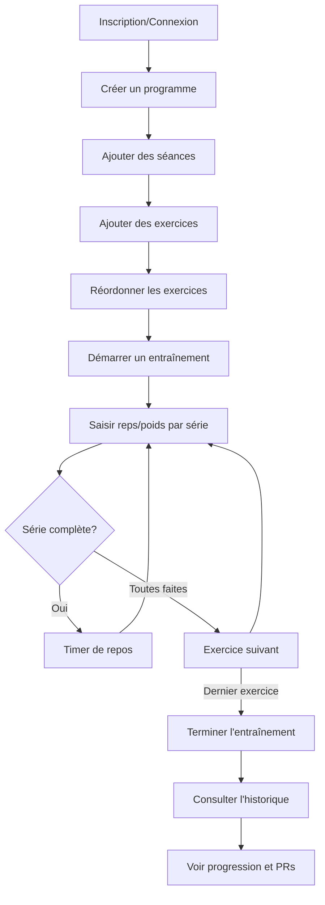

# GymTracker - Spécifications Fonctionnelles

## 1. Vue d'Ensemble

**GymTracker** est une application web mobile-first de suivi d'entraînement en musculation. Elle permet de créer des programmes d'entraînement personnalisés, de suivre ses performances en temps réel et de consulter son historique avec détection automatique des records personnels.

### Stack Technique
- **Frontend**: React 18 (via CDN avec Babel)
- **Backend/BDD**: Supabase (PostgreSQL)
- **Authentification**: Supabase Auth
- **Styles**: CSS vanilla (fichier séparé) avec design system personnalisé
- **PWA**: Support manifest pour installation mobile

### Structure du Projet

```
gymtracker/
├── index.html              # Application React (HTML + JS)
├── css/
│   └── styles.css          # Feuilles de styles
├── sql/
│   ├── migration-position.sql   # Migration colonne position
│   ├── migration-profiles.sql   # Migration table profiles
│   └── rls-policies.sql         # Politiques Row Level Security
├── .gitignore
├── README.md
└── specifications_fonctionnelles.md
```

---

## 2. Architecture des Données

### 2.1 Modèle de Données

```mermaid
erDiagram
    users ||--|| profiles : has
    users ||--o{ programs : owns
    users ||--o{ workout_history : owns
    programs ||--o{ sessions : contains
    sessions ||--o{ exercises : contains

    profiles {
        uuid id PK_FK
        string first_name
        string last_name
        int height
        decimal weight
        timestamp created_at
        timestamp updated_at
    }

    programs {
        uuid id PK
        uuid user_id FK
        string name
        timestamp created_at
    }

    sessions {
        uuid id PK
        uuid program_id FK
        string name
    }

    exercises {
        uuid id PK
        uuid session_id FK
        string name
        int sets
        int rest_time
        string notes
        int position
    }

    workout_history {
        uuid id PK
        uuid user_id FK
        uuid program_id
        string program_name
        uuid session_id
        string session_name
        jsonb exercises
        timestamp started_at
        timestamp completed_at
        int duration
    }
```

### 2.2 Sécurité (Row Level Security)

Chaque table est protégée par des politiques RLS garantissant l'isolation des données par utilisateur:
- **profiles**: Accès direct via `id` (= `auth.uid()`)
- **programs**: Accès direct via `user_id`
- **sessions**: Accès via jointure `program_id → programs.user_id`
- **exercises**: Accès via jointure `session_id → sessions.program_id → programs.user_id`
- **workout_history**: Accès direct via `user_id`

### 2.3 Table Profiles - Détails d'implémentation

#### Colonnes requises

```sql
CREATE TABLE profiles (
    id UUID PRIMARY KEY REFERENCES auth.users(id),
    email TEXT NOT NULL,
    first_name TEXT,
    last_name TEXT,
    height INTEGER,
    weight DECIMAL(5,2),
    created_at TIMESTAMPTZ DEFAULT NOW(),
    updated_at TIMESTAMPTZ DEFAULT NOW()
);
```

#### Migration (ajout des colonnes manquantes)

```sql
ALTER TABLE profiles
ADD COLUMN first_name TEXT,
ADD COLUMN last_name TEXT,
ADD COLUMN height INTEGER,
ADD COLUMN weight DECIMAL(5,2),
ADD COLUMN updated_at TIMESTAMPTZ DEFAULT NOW();
```

#### Politiques RLS requises

```sql
-- Lecture du profil
CREATE POLICY "Users can view their own profile"
ON profiles FOR SELECT
TO authenticated
USING (auth.uid() = id);

-- Insertion du profil (pour le trigger ou inscription)
CREATE POLICY "Users can insert their own profile"
ON profiles FOR INSERT
TO authenticated
WITH CHECK (auth.uid() = id);

-- Mise à jour du profil
CREATE POLICY "Users can update their own profile"
ON profiles FOR UPDATE
TO authenticated
USING (auth.uid() = id)
WITH CHECK (auth.uid() = id);
```

#### Trigger pour création automatique

Un trigger `handle_new_user` crée automatiquement un profil vide lors de l'inscription. Ce trigger peut utiliser `updated_at`, d'où la nécessité de cette colonne.

#### Méthode de mise à jour (JavaScript)

La fonction `db.updateProfile()` utilise `update` car le profil est créé automatiquement par le trigger `handle_new_user` lors de l'inscription :

```javascript
async updateProfile(userId, profileData) {
    const { error } = await supabase
        .from('profiles')
        .update({
            email: profileData.email,
            first_name: profileData.firstName,
            last_name: profileData.lastName,
            height: profileData.height,
            weight: profileData.weight
        })
        .eq('id', userId);

    if (error) {
        console.error('Profile update error:', error);
        throw error;
    }
}
```

**Important** : L'email doit être inclus car la colonne a une contrainte NOT NULL.

---

## 3. Fonctionnalités Détaillées

### 3.1 Authentification

| Fonctionnalité | Description |
|----------------|-------------|
| **Inscription** | Email + mot de passe (min 6 caractères) + profil (prénom, nom, taille, poids) |
| **Connexion** | Email + mot de passe |
| **Déconnexion** | Bouton dans l'onglet Compte |
| **Persistance** | Session automatique via Supabase Auth |

#### Formulaire d'inscription
| Champ | Type | Validation |
|-------|------|------------|
| Prénom | Texte | Obligatoire |
| Nom | Texte | Obligatoire |
| Taille | Nombre | 100-250 cm, obligatoire |
| Poids | Nombre décimal | 30-300 kg, obligatoire |
| Email | Email | Format email valide |
| Mot de passe | Texte | Min 6 caractères |

### 3.2 Gestion des Programmes

#### Création
- Nom du programme (texte libre)
- Association automatique à l'utilisateur connecté

#### Affichage
- Liste de cartes expansibles
- Nombre de séances affiché
- Si un seul programme : déplié par défaut via `useEffect` sur `programs` (pour gérer le chargement async) ; si plusieurs : tous repliés
- Actions: supprimer le programme (texte gris discret `btn-ghost-muted`)

#### Suppression
- Confirmation requise
- Suppression en cascade des séances et exercices

### 3.3 Gestion des Séances

#### Création
- Nom de la séance (ex: "Push", "Pull", "Legs")
- Association au programme parent

#### Affichage
- Liste imbriquée dans le programme
- Nombre d'exercices affiché
- Bouton d'accès rapide play (rond orange 40px, `btn-quick-start`) visible sur chaque card séance pour démarrer directement
- Expansion pour voir le détail (clic sur le texte de la séance)

#### Actions
- Ajouter des exercices
- Démarrer l'entraînement (bouton play rapide ou bouton orange pleine largeur dans la séance ouverte)
- Supprimer la séance (texte rouge simple `btn-ghost-danger`, sans bordure)

#### Hiérarchie des boutons (section Programmes)
| Priorité | Action | Style |
|----------|--------|-------|
| 1 (max) | Démarrer séance (quick-start) | Bouton rond orange 40px + ombre |
| 2 | Démarrer (séance ouverte) | Bouton orange pleine largeur |
| 3 | Créer programme / Nouvelle séance / Ajouter exercice | Boutons gris secondaires |
| 4 | Supprimer séance | Texte rouge sans bordure |
| 5 (min) | Supprimer programme | Texte gris discret |

### 3.4 Gestion des Exercices

#### Création/Modification
| Champ | Type | Description |
|-------|------|-------------|
| Nom | Texte | Nom de l'exercice (ex: "Développé Couché") |
| Séries | Nombre | Nombre de séries (1-20) |
| Temps de repos | Nombre | Secondes entre séries |
| Notes | Texte | Instructions optionnelles |

#### Réordonnancement (Drag & Drop)
- Support tactile avec délai de 150ms
- Affichage du numéro d'ordre
- Ghost element pendant le drag
- Indicateurs visuels de position

### 3.5 Mode Entraînement

#### Démarrage
- Depuis une séance dans un programme
- Persistance locale (localStorage) pour éviter la perte de données

#### Interface de Tracking

```
+--------------------------------+
|  Programme → Séance            |
|  Exercice 2/5                  |
+--------------------------------+
|  [clock] TEMPS DE REPOS: 45s   |
|  [Passer]                      |
+--------------------------------+
|  [file-text] Notes exercice    |
+--------------------------------+
|  PERFORMANCES PASSÉES          |
|  S1: 10 × 60kg [trophy] PR     |
|  S2: 8 × 60kg                  |
+--------------------------------+
|  S1  [Reps] [-- - 60kg + ++]   |
|       [FAIT [check]]           |
|  S2  [Reps] [-- - 60kg + ++]   |
|       [FAIT [check]]           |
+--------------------------------+
|  [[chevron-left] Préc.]        |
|  [Suivant [chevron-right]]     |
+--------------------------------+
```

#### Fonctionnalités du Tracker
| Fonctionnalité | Description |
|----------------|-------------|
| **Steppers poids** | Boutons ±2.5kg et ±5kg |
| **Auto-remplissage** | Valeurs de la dernière séance |
| **Timer de repos** | Décompte automatique après validation (fond vert success) |
| **Vibration** | Alerte fin de repos (si supporté) |
| **Skip timer** | Bouton pour passer le repos |
| **Comparaison** | Badge +Xkg ou +X reps vs dernière fois (icône `arrow-up`) |
| **Détection PR** | Notification avec icône `trophy` "Nouveau record personnel !" |

#### Fin d'Entraînement
- Modal avec 3 options:
  - Icône `check` Enregistrer dans l'historique
  - Icône `trash` Supprimer sans enregistrer
  - Continuer l'entraînement

### 3.6 Historique

#### Filtres de vue
- Bouton `calendar` "Séances" / Bouton `dumbbell` "Exercices"
- Style: Pill buttons avec état actif (fond primary)

#### Vue "Séances"
- Liste chronologique (plus récent en premier)
- Filtrage par programme (boutons pill)
- Pour chaque séance:
  - Date formatée (Aujourd'hui, Hier, ou date complète)
  - Stat badge `clock` Durée en minutes
  - Stat badge `dumbbell` Nombre d'exercices
  - Détail expansible avec séries réalisées
  - Actions: bouton `trash` supprimer, bouton `edit` modifier

#### Vue "Exercices"
- Liste de tous les exercices effectués
- Record personnel (PR) affiché avec icône `trophy`
- Nombre de séances pour chaque exercice
- Détail expansible: 5 dernières performances

### 3.7 Modification de l'Historique

- Édition des reps/poids d'un exercice enregistré
- Suppression d'un exercice de l'historique
- Suppression complète d'une séance

---

## 4. Interface Utilisateur

### 4.1 Design System - "Clean & Functional"

**Style**: Utilitaire et efficace, inspiré de "Strong" et "Hevy"

| Variable CSS | Valeur | Usage |
|--------------|--------|-------|
| `--bg-primary` | #FFFFFF | Fond principal (blanc pur) |
| `--bg-secondary` | #F8F9FA | Sections et cartes |
| `--bg-tertiary` | #F1F3F5 | Éléments secondaires |
| `--primary` | #1E3A5F | Bleu profond (texte et éléments principaux) |
| `--accent` | #FF6B35 | Orange (actions et mise en avant) |
| `--accent-hover` | #E85A2A | Orange foncé (hover) |
| `--accent-light` | #FFF0EB | Orange clair (fond de focus) |
| `--success` | #10B981 | Timer, validations |
| `--danger` | #EF4444 | Suppression, erreurs |
| `--text-primary` | #1E3A5F | Texte principal |
| `--text-secondary` | #6B7280 | Texte secondaire |
| `--text-muted` | #9CA3AF | Texte désactivé/léger |
| `--border` | #E5E7EB | Bordures fines |

**Caractéristiques visuelles**:
- Fond blanc pur avec sections grises très légères
- Cartes avec bordures fines (1px) et coins moyens (10-18px)
- Données mises en avant avec grands chiffres
- Ombres subtiles (`box-shadow`) pour hiérarchie visuelle

### 4.2 Typographie
- **Police unique**: Plus Jakarta Sans (Google Fonts)
- **Poids**: 400 (regular), 500 (medium), 600 (semi-bold), 700 (bold), 800 (extra-bold)
- **Titres**: 20-28px, font-weight 800
- **Corps**: 13-16px, font-weight 400-600
- **Labels**: 10-12px, uppercase, letter-spacing 0.5px

### 4.3 Icônes
- **Bibliothèque**: Lucide Icons (SVG inline)
- **Composant React**: `<Icon name="..." size={...} />`
- **Tailles standards**:
  - `icon-sm`: 16px (boutons, badges)
  - `icon`: 20px (par défaut)
  - `icon-lg`: 24px (navigation)
  - `icon-xl`: 32-48px (empty states)
- **Icônes principales**:
  - `clipboard-list`: Programmes
  - `dumbbell`: Entraînement/Exercices
  - `bar-chart`: Historique
  - `user`: Compte
  - `trophy`: Records personnels
  - `clock`: Temps/Durée
  - `flame`: Volume
  - `trash`: Suppression
  - `edit`: Modification
  - `play`: Démarrer
  - `check`: Validation
  - `x`: Fermer

### 4.4 Responsive Design
- **Mobile standard** (≤480px): Grid compact, steppers réduits
- **Très petit écran** (≤360px): Steppers ±5 masqués, tailles réduites
- **Tablette** (≤768px): Ajustements intermédiaires

### 4.5 Navigation
- Header sticky avec titre "GymTracker" (font-weight 800, couleur primary)
- Navigation fixe en bas (bottom tab bar) avec bordure supérieure fine
- 4 onglets avec icônes Lucide SVG:
  - `clipboard-list` Programmes
  - `dumbbell` Entraînement
  - `bar-chart` Historique
  - `user` Compte
- État actif: couleur accent (#FF6B35), stroke-width 2.5

### 4.6 Vue Compte

La vue Compte est organisée en 3 blocs distincts de haut en bas:

#### A. Bloc Motivation / Vue d'ensemble

**Statistiques de la semaine courante** (lundi → dimanche):

| Statistique | Icône Lucide | Description |
|-------------|--------------|-------------|
| Entraînements | `activity` | Nombre de séances cette semaine (scorecard mise en avant avec fond accent) |
| Volume total | `flame` | Somme de tous les kg × reps de la semaine |
| Temps total | `clock` | Durée cumulée des entraînements de la semaine |

**Graphique des 5 dernières semaines**:
- Type: Barres verticales arrondies (border-radius 8px, max-width 40px)
- Données: Nombre de séances par semaine
- Période: Semaine courante + 4 semaines précédentes
- Semaine: Lundi → Dimanche
- Labels: Format "14-20 janv."
- Hauteur du conteneur: 140px, avec zone de barre isolée dans un conteneur flex-grow (`.chart-bar-area`) empêchant tout débordement
- Échelle: `maxWorkouts` fixé à minimum 5 pour un rendu proportionné
- Couleurs progressives: semaines passées en bleu marine (`--primary` #1E3A5F) avec opacité croissante de 15% à 40% (de la plus ancienne à la plus récente)
- Semaine courante: barre en couleur accent (#FF6B35) avec glow orange (`box-shadow`), valeur affichée en orange et taille 14px

#### B. Bloc Profil

**Affichage**:
- Avatar circulaire avec initiales (fond bleu profond #1E3A5F, texte blanc)
- Prénom affiché en grand (font-weight 700)
- Nom complet affiché en dessous (couleur secondaire)
- `ruler` Taille: XX cm
- `scale` Poids: XX kg

**Fonctionnalité d'édition**:
- Bouton avec icône `edit` "Modifier le profil"
- Ouvre une modal avec formulaire éditable:
  - Prénom (texte)
  - Nom (texte)
  - Taille (nombre en cm)
  - Poids (nombre en kg avec décimales)
- Boutons: "Annuler" / "Enregistrer"

#### C. Actions

- Bouton avec icône `log-out` "Se déconnecter" (style outline danger)

---

## 5. Persistance et Synchronisation

### 5.1 Données Cloud (Supabase)
- Programmes, séances, exercices
- Historique des entraînements
- Synchronisation temps réel

### 5.2 Données Locales (localStorage)
- `gymtracker_active_workout`: Entraînement en cours
- Protection contre la perte de données (refresh, fermeture)
- Nettoyage automatique à la fin de l'entraînement
- Réinitialisation du chrono si l'entraînement restauré date de plus de 6h (évite les durées aberrantes)

---

## 6. Parcours Utilisateur Type



---

## 7. Évolutions Potentielles

> [!TIP]
> Suggestions pour les futures versions

- **Graphiques de progression par exercice**: Visualisation des courbes de poids/reps par exercice
- **Templates d'exercices**: Bibliothèque prédéfinie
- **Mode hors-ligne**: Sync différée avec Service Worker
- **Export des données**: CSV/JSON
- **Partage de programmes**: Liens publics
- **Notifications push**: Rappels d'entraînement
- **Minuteur personnalisable**: Ajustement rapide pendant l'entraînement
- **Suivi du poids corporel**: Historique des pesées avec graphique
