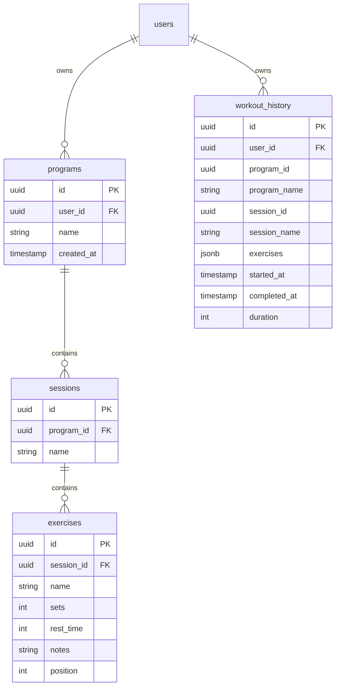
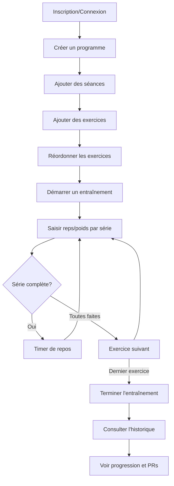

# GymTracker - Spécifications Fonctionnelles

## 1. Vue d'Ensemble

**GymTracker** est une application web mobile-first de suivi d'entraînement en musculation. Elle permet de créer des programmes d'entraînement personnalisés, de suivre ses performances en temps réel et de consulter son historique avec détection automatique des records personnels.

### Stack Technique
- **Frontend**: React 18 (via CDN avec Babel)
- **Backend/BDD**: Supabase (PostgreSQL)
- **Authentification**: Supabase Auth
- **Styles**: CSS vanilla (fichier séparé) avec design system personnalisé
- **PWA**: Support manifest pour installation mobile

### Structure du Projet

```
gymtracker/
├── index.html              # Application React (HTML + JS)
├── css/
│   └── styles.css          # Feuilles de styles
├── sql/
│   ├── migration-position.sql   # Migration colonne position
│   └── rls-policies.sql         # Politiques Row Level Security
├── .gitignore
├── README.md
└── specifications_fonctionnelles.md
```

---

## 2. Architecture des Données

### 2.1 Modèle de Données



### 2.2 Sécurité (Row Level Security)

Chaque table est protégée par des politiques RLS garantissant l'isolation des données par utilisateur:
- **programs**: Accès direct via `user_id`
- **sessions**: Accès via jointure `program_id → programs.user_id`
- **exercises**: Accès via jointure `session_id → sessions.program_id → programs.user_id`
- **workout_history**: Accès direct via `user_id`

---

## 3. Fonctionnalités Détaillées

### 3.1 Authentification

| Fonctionnalité | Description |
|----------------|-------------|
| **Inscription** | Email + mot de passe (min 6 caractères) |
| **Connexion** | Email + mot de passe |
| **Déconnexion** | Bouton dans l'onglet Compte |
| **Persistance** | Session automatique via Supabase Auth |

### 3.2 Gestion des Programmes

#### Création
- Nom du programme (texte libre)
- Association automatique à l'utilisateur connecté

#### Affichage
- Liste de cartes expansibles
- Nombre de séances affiché
- Actions: supprimer le programme

#### Suppression
- Confirmation requise
- Suppression en cascade des séances et exercices

### 3.3 Gestion des Séances

#### Création
- Nom de la séance (ex: "Push", "Pull", "Legs")
- Association au programme parent

#### Affichage
- Liste imbriquée dans le programme
- Nombre d'exercices affiché
- Expansion pour voir le détail

#### Actions
- Ajouter des exercices
- Démarrer l'entraînement
- Supprimer la séance

### 3.4 Gestion des Exercices

#### Création/Modification
| Champ | Type | Description |
|-------|------|-------------|
| Nom | Texte | Nom de l'exercice (ex: "Développé Couché") |
| Séries | Nombre | Nombre de séries (1-20) |
| Temps de repos | Nombre | Secondes entre séries |
| Notes | Texte | Instructions optionnelles |

#### Réordonnancement (Drag & Drop)
- Support tactile avec délai de 150ms
- Affichage du numéro d'ordre
- Ghost element pendant le drag
- Indicateurs visuels de position

### 3.5 Mode Entraînement

#### Démarrage
- Depuis une séance dans un programme
- Persistance locale (localStorage) pour éviter la perte de données

#### Interface de Tracking

```
+--------------------------------+
|  Programme → Séance            |
|  Exercice 2/5                  |
+--------------------------------+
|  ⏱️ TEMPS DE REPOS: 45s        |
|  [Passer]                      |
+--------------------------------+
|  📝 Notes de l'exercice        |
+--------------------------------+
|  PERFORMANCES PASSÉES          |
|  S1: 10 × 60kg 🏆 PR           |
|  S2: 8 × 60kg                  |
+--------------------------------+
|  S1  [Reps] [-- - 60kg + ++]   |
|       [FAIT ✓]                 |
|  S2  [Reps] [-- - 60kg + ++]   |
|       [FAIT ✓]                 |
+--------------------------------+
|  [← Préc.]  [Suivant →]        |
+--------------------------------+
```

#### Fonctionnalités du Tracker
| Fonctionnalité | Description |
|----------------|-------------|
| **Steppers poids** | Boutons ±2.5kg et ±5kg |
| **Auto-remplissage** | Valeurs de la dernière séance |
| **Timer de repos** | Décompte automatique après validation |
| **Vibration** | Alerte fin de repos (si supporté) |
| **Skip timer** | Bouton pour passer le repos |
| **Comparaison** | Badge +Xkg ou +X reps vs dernière fois |
| **Détection PR** | Notification "🎉 Nouveau record personnel !" |

#### Fin d'Entraînement
- Modal avec 3 options:
  - ✓ Enregistrer dans l'historique
  - 🗑️ Supprimer sans enregistrer
  - Continuer l'entraînement

### 3.6 Historique

#### Vue "Séances"
- Liste chronologique (plus récent en premier)
- Filtrage par programme
- Pour chaque séance:
  - Date formatée (Aujourd'hui, Hier, ou date complète)
  - Durée en minutes
  - Nombre d'exercices
  - Détail expansible avec séries réalisées
  - Actions: supprimer la séance, modifier/supprimer un exercice

#### Vue "Exercices"
- Liste de tous les exercices effectués
- Record personnel (PR) affiché
- Nombre de séances pour chaque exercice
- Détail expansible: 5 dernières performances

### 3.7 Modification de l'Historique

- Édition des reps/poids d'un exercice enregistré
- Suppression d'un exercice de l'historique
- Suppression complète d'une séance

---

## 4. Interface Utilisateur

### 4.1 Design System

| Variable CSS | Valeur | Usage |
|--------------|--------|-------|
| `--bg-primary` | #FFF5F0 | Fond principal |
| `--bg-secondary` | #FFFFFF | Cartes, modals |
| `--bg-tertiary` | #FFE8E0 | Éléments secondaires |
| `--accent` | #FF6B6B | Couleur principale (corail) |
| `--success` | #4ECDC4 | Timer, validations |
| `--text-primary` | #2D2D2D | Texte principal |
| `--text-secondary` | #8B8B8B | Texte secondaire |

### 4.2 Typographie
- **Titres**: Poppins (600-800)
- **Corps**: DM Sans (400-700)

### 4.3 Responsive Design
- **Mobile standard** (≤480px): Grid compact, steppers réduits
- **Très petit écran** (≤360px): Steppers ±5 masqués, tailles réduites
- **Tablette** (≤768px): Ajustements intermédiaires

### 4.4 Navigation
- Header sticky avec titre uniquement
- Navigation fixe en bas de l'écran (bottom tab bar)
- 4 onglets avec icônes:
  - 📋 Programmes
  - 🏋️ Entraînement
  - 📊 Historique
  - 👤 Compte

### 4.5 Vue Compte
- Avatar avec initiale de l'email
- Statistiques:
  - Nombre de séances cette année
  - Total des séances
- Bouton de déconnexion

---

## 5. Persistance et Synchronisation

### 5.1 Données Cloud (Supabase)
- Programmes, séances, exercices
- Historique des entraînements
- Synchronisation temps réel

### 5.2 Données Locales (localStorage)
- `gymtracker_active_workout`: Entraînement en cours
- Protection contre la perte de données (refresh, fermeture)
- Nettoyage automatique à la fin de l'entraînement

---

## 6. Parcours Utilisateur Type



---

## 7. Évolutions Potentielles

> [!TIP]
> Suggestions pour les futures versions

- **Graphiques de progression**: Visualisation des courbes de performance
- **Templates d'exercices**: Bibliothèque prédéfinie
- **Mode hors-ligne**: Sync différée avec Service Worker
- **Export des données**: CSV/JSON
- **Partage de programmes**: Liens publics
- **Notifications push**: Rappels d'entraînement
- **Minuteur personnalisable**: Ajustement rapide pendant l'entraînement
